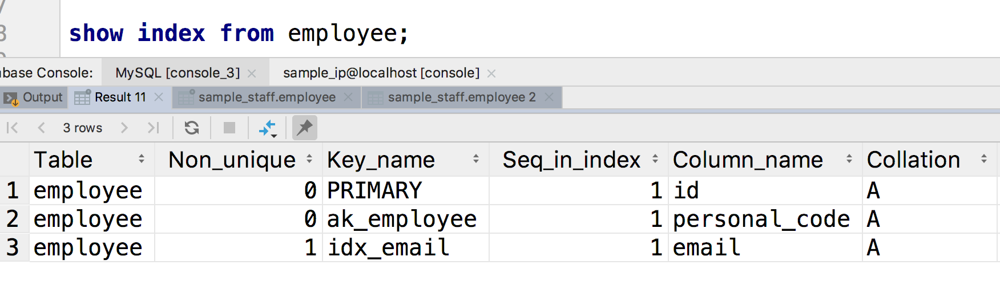
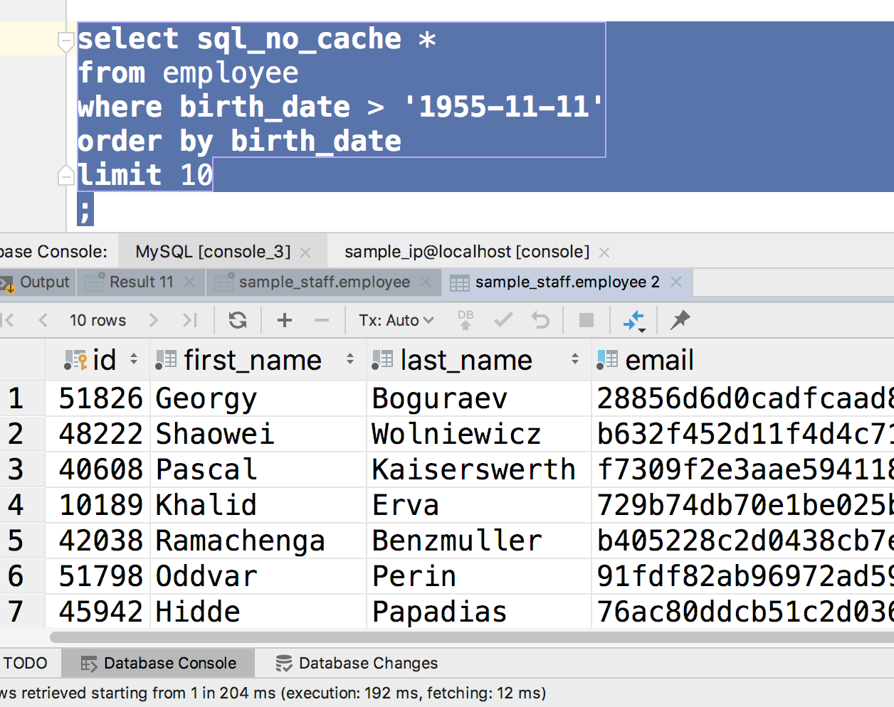
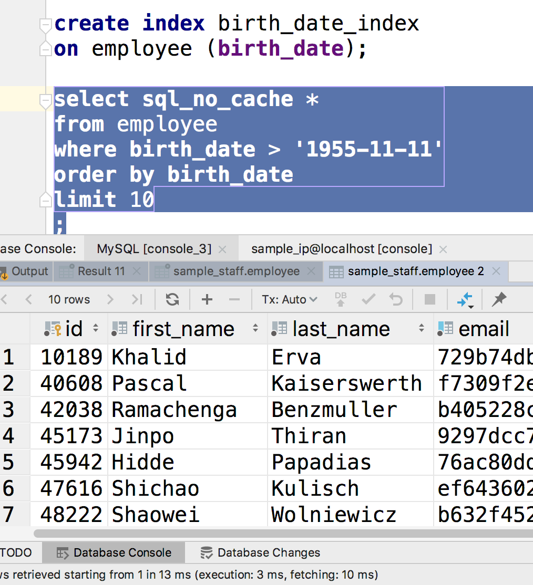

## indexing

### 什么是索引？

假设我们想在一个未排序的数组中寻找到符合某一条件的元素，我们可能要遍历数组。但是如果数组是排序的，我们可以用二分查找法光速的查找。 

给表的某一列添加索引，就是开辟一个单独的空间，来存储这一列排序后的结果。

这意味着：

- 对这一行使用where之类的查询，将会变得非常快
- 需要额外的存储空间
- 插入数据变慢了

### 示例

首先我们来看下我们的的employee表


```sql
mysql> show index from employee;
+----------+------------+-------------+--------------+---------------+-----------+-------------+----------+--------+------+------------+---------+---------------+---------+------------+
| Table    | Non_unique | Key_name    | Seq_in_index | Column_name   | Collation | Cardinality | Sub_part | Packed | Null | Index_type | Comment | Index_comment | Visible | Expression |
+----------+------------+-------------+--------------+---------------+-----------+-------------+----------+--------+------+------------+---------+---------------+---------+------------+
| employee |          0 | PRIMARY     |            1 | id            | A         |      297383 |     NULL |   NULL |      | BTREE      |         |               | YES     | NULL       |
| employee |          0 | ak_employee |            1 | personal_code | A         |      297383 |     NULL |   NULL |      | BTREE      |         |               | YES     | NULL       |
| employee |          1 | idx_email   |            1 | email         | A         |      297383 |     NULL |   NULL |      | BTREE      |         |               | YES     | NULL       |
+----------+------------+-------------+--------------+---------------+-----------+-------------+----------+--------+------+------------+---------+---------------+---------+------------+
```



可以看到，我们一开始只有三个索引，分别对应`id` `personal_code` `email`而`birth_date`这一列没有索引。

所以我们来尝试下对这一行进行查询：

```sql
select sql_no_cache *
from employee
where birth_date > '1955-11-11'
order by birth_date
limit 10
;
```



读者注意到图片**最下面一行**所用的时间了吗？ 192ms，太长了。


接下来我们给这一行添加上索引：

```sql
create index birth_date_index
on employee (birth_date);

select sql_no_cache *
from employee
where birth_date > '1955-11-11'
order by birth_date
limit 10
;
```



这下你注意到时间了吗，只要3ms，这对查询速度的提升太大了。