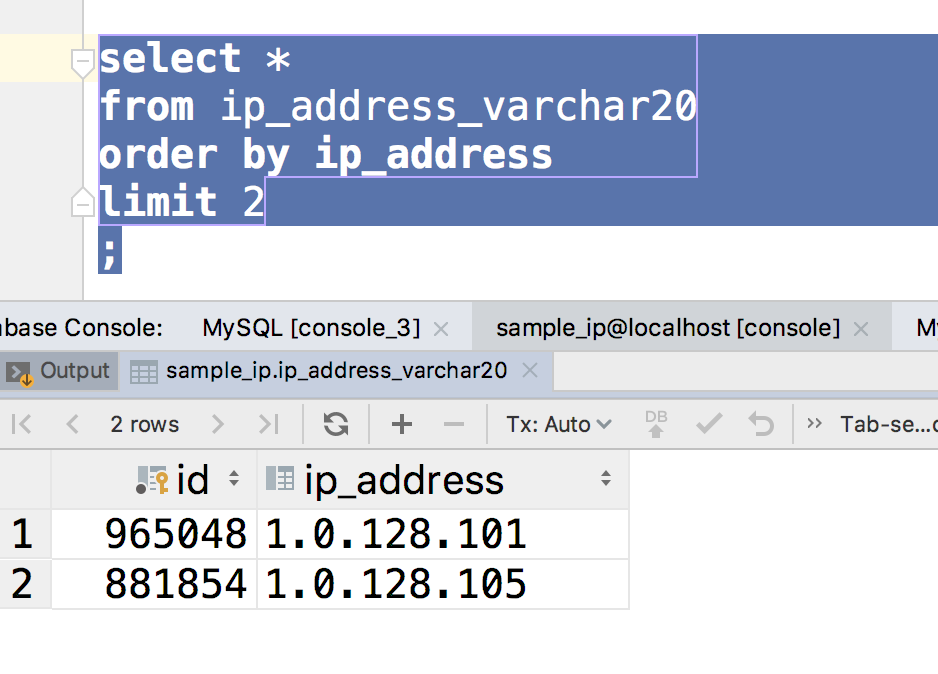
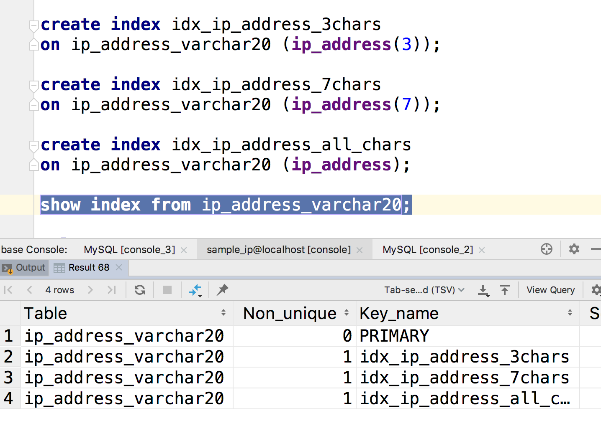
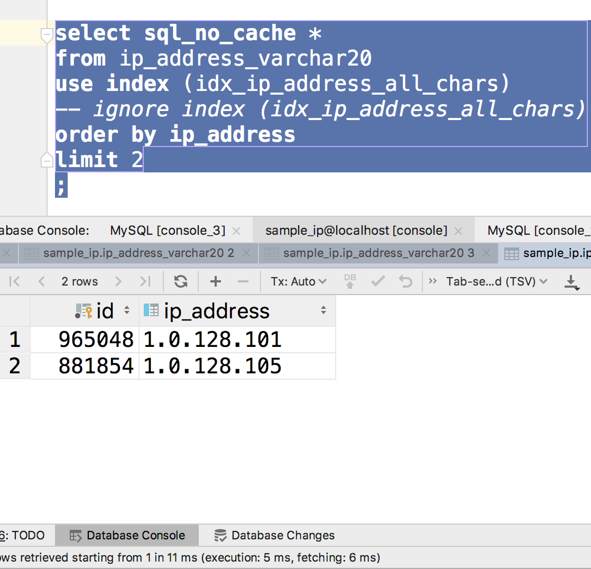
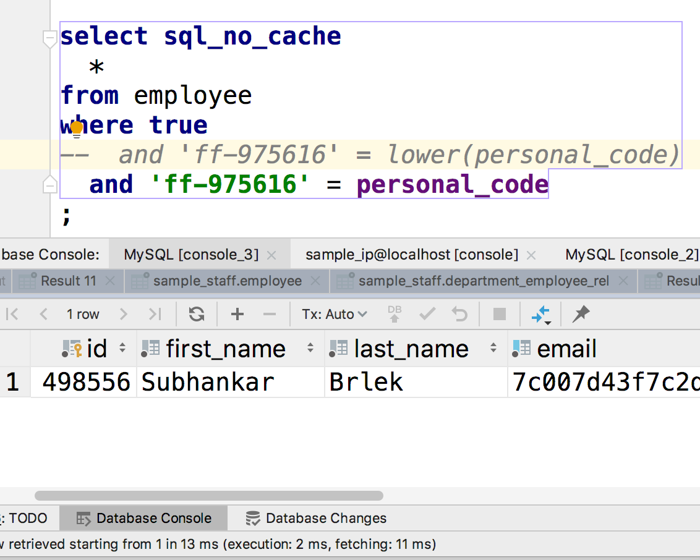
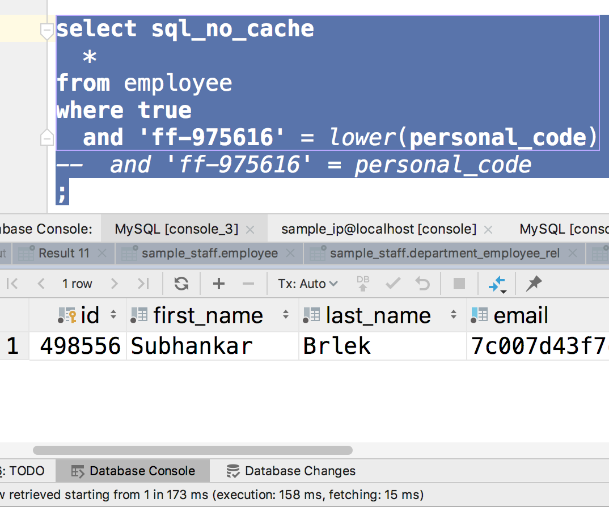

来使用一下我们的ip_address_varchar20这个表，目前它的状态是这样的

- 有将近300万条记录
- ip_address是用字符串记录的，而且这列没有索引

如果你之前改动过它，记得和我保持一致。



然后这是我们的ip数据库，当前状态是ip_address是没有索引的，然后我想找到ip字符串最小的两条记录。

这个查询大概用了30秒。很恐怖对吧，要是线上环境这样，用户早就跑了。我们也可以从公司卷铺盖走人了。


然后我们给这个字段添加索引：

```sql
create index idx_ip_address_3chars
on ip_address_varchar20 (ip_address(3));

create index idx_ip_address_7chars
on ip_address_varchar20 (ip_address(7));

create index idx_ip_address_all_chars
on ip_address_varchar20 (ip_address);

show index from ip_address_varchar20;
```

这个过程也是非常慢的，耐性下，我用了8分钟。




上面我们在同一列上创建了三种索引

- `ip_address(3)`： 只是用前三个字符作为索引,`124.1.1.1`和`124.23.123.1`是一样的。
- `ip_address`：使用全部的字符作为索引，有些时候浪费空间。

```sql
select sql_no_cache *
from ip_address_varchar20
-- use index (idx_ip_address_all_chars)
order by ip_address
limit 2
;
```



创建索引后可以用光速来形容。


### 索引失效

- lower这样的函数会造成索引失效


目前，我们的employee表在personnal_code上有一个索引，所以正常查询时速度很快



但是使用lower函数后，索引失效了。




### 多重索引

```sql
explain
select sql_no_cache
  id,
  personal_code
from employee
-- use index (ak_employee)  -- 1.2 s
-- use index (PRIMARY)    -- 122ms
use index (PRIMARY, ak_employee)  -- 4ms
where (
  personal_code = '7c-91159'
  or
    id between 12380 and 12400
)
;
```

只用一个索引会变慢，默认会优化为两个索引